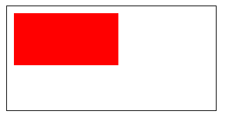
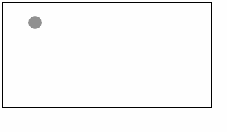
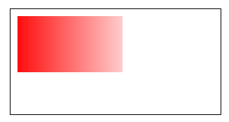
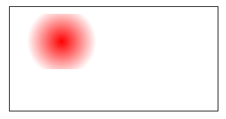

# Canvas 
This section explains the concept of Canvas.

***

All the drawings in canvas must be completed with JavaScript:

WXML: (Unless otherwise specified, WXML is used as a template in the following example)

```xml
<canvas canvas-id="myCanvas" style="border: 1px solid;"/>
```

JS: (JS is placed in onLoad in the following example)

```javascript
// javascript
const ctx = wx.createCanvasContext('myCanvas')
ctx.setFillStyle('red')
ctx.fillRect(10, 10, 150, 75)
ctx.draw()
```

### Step 1: Create a Canvas drawing context

First, we need to create a Canvas drawing context CanvasContext. A CanvasContext is an object built in the Mini Program, featuring several drawing methods:

### Step 2: Use the Canvas drawing context to describe the drawing

Next, we will describe what content to draw on the Canvas. You can set the fill color of the drawing context to red by writing the below code:

```javascript
// javascript
ctx.setFillStyle('red')
```

Draw a rectangle using the fillRect(x, y, width, height) method, and fill it with red as just set:

```javascript
// javascript
ctx.fillRect(10, 10, 150, 75)
```

### Step 3: Draw

Guide the canvas component to draw the content you just described by writing the below code:

```
ctx.draw()
```

### Result:



## Coordinate System

Canvas is a two-dimensional grid. The coordinates of the upper left corner are `(0, 0)`.

In the previous section, we used the method `fillRect(0, 0, 150, 75)`. This indicates that, starting from the upper left corner (0, 0), draw a `150 x 75` px rectangle.

### Code sample

We can add events in canvas to observe its coordinate system.

```xml

<canvas canvas-id="myCanvas"
  style="margin: 5px; border:1px solid #d3d3d3;"
  bindtouchstart="start"
  bindtouchmove="move"
  bindtouchend="end"/>

<view hidden="{{hidden}}">
  Coordinates: ({{x}}, {{y}})
</view>

```

```javascript
// code
Page({
  data: {
    x: 0,
    y: 0,
    hidden: true
  },
  start (e) {
    this.setData({
      hidden: false,
      x: e.touches[0].x,
      y: e.touches[0].y
    })
  },
  move (e) {
    this.setData({
      x: e.touches[0].x,
      y: e.touches[0].y
    })
  },
  end (e) {
    this.setData({
      hidden: true
    })
  }
})
```

When you put your finger on the canvas, the coordinates of the point you touch are displayed at the bottom of the page:



## Gradient

A gradient can be used to fill a rectangle, circle, line, text, etc. The fill color is not always the same.

Two color gradient methods are available:

- `createLinearGradient(x, y, x1, y1)` - it creates a linear gradient.
- `createCircularGradient(x, y, r) `- it creates a gradient from the center of the circle.

Once we create a gradient object, we must add two color gradient points.

The `addColorStop(position, color)` method is used to specify the position and color of a color gradient point. The position must be between 0 and 1.

You can use the `setFillStyle` and `setStrokeStyle` methods to set the gradient and then describe the drawing.

**Use** `createLinearGradient()`

```javascript
// code
const ctx = wx.createCanvasContext('myCanvas')

// Create linear gradient
const grd = ctx.createLinearGradient(0, 0, 200, 0)
grd.addColorStop(0, 'red')
grd.addColorStop(1, 'white')

// Fill with gradient
ctx.setFillStyle(grd)
ctx.fillRect(10, 10, 150, 80)
ctx.draw()
```



**Use**` createCircularGradient()`

```javascript
// code
const ctx = wx.createCanvasContext('myCanvas')

// Create circular gradient
const grd = ctx.createCircularGradient(75, 50, 50)
grd.addColorStop(0, 'red')
grd.addColorStop(1, 'white')

// Fill with gradient
ctx.setFillStyle(grd)
ctx.fillRect(10, 10, 150, 80)
ctx.draw()
```


